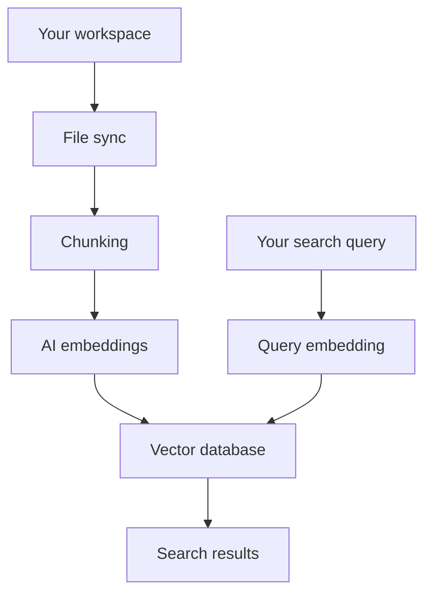

# Semantic Search

Semantic search finds code by understanding its meaning, not just matching text. Ask natural language questions like "where is authentication handled?" and get relevant results across your entire codebase.

## How it works

Cursor transforms your code into searchable vectors through a 7-step process:

1. Your workspace files are securely synchronized with Cursor's servers to keep the index current and up-to-date.

2. Files are broken down into meaningful chunks that capture the essence of your code—functions, classes, and logical code blocks rather than arbitrary text segments.

3. Each chunk is converted into a vector representation using AI models. This creates a mathematical fingerprint that captures the semantic meaning of your code.

4. These embeddings are stored in a specialized vector database optimized for fast similarity search across millions of code chunks.

5. When you search, your query is converted into a vector using the same AI models that processed your code.

6. The system finds the most similar code chunks by comparing your query's vector against stored embeddings.

7. You get relevant code snippets with file locations and context, ranked by semantic similarity to your search.



## Why semantic search?

While tools like `grep` and `ripgrep` are useful for finding exact string matches, semantic search goes further by understanding the meaning behind your code.

If you ask Agent to "update the top navigation", semantic search can find `header.tsx` even though the word "navigation" doesn't appear in the filename. This works because the embeddings understand that "header" and "top navigation" are semantically related.

### Benefits over grep alone

Semantic search provides several advantages:

- **Faster results**: Compute happens during indexing (offline) rather than at runtime, so Agent searches are faster and cheaper
- **Better accuracy**: Custom-trained models retrieve more relevant results than string matching
- **Fewer follow-ups**: Users send fewer clarifying messages and use fewer tokens compared to grep-only search
- **Conceptual matching**: Find code by what it does, not just what it's named

Agent uses **both** grep and semantic search together. Grep excels at finding
exact patterns, while semantic search excels at finding conceptually similar
code. This combination delivers the best results.

## Getting started

### First-time indexing

Indexing begins automatically when you open a workspace. The system scans your workspace structure, uploads files securely, and processes them through AI models to create embeddings. **Semantic search becomes available at 80% completion.**

## Keeping your index updated

### Automatic sync

Cursor automatically keeps your index synchronized with your workspace through periodic checks every 5 minutes. The system intelligently updates only changed files, removing old embeddings and creating new ones as needed. Files are processed in batches for optimal performance, ensuring minimal impact on your development workflow.

### What gets indexed

| File Type           | Action                                     |
| ------------------- | ------------------------------------------ |
| New files           | Automatically added to index               |
| Modified files      | Old embeddings removed, fresh ones created |
| Deleted files       | Promptly removed from index                |
| Large/complex files | May be skipped for performance             |

### Performance and troubleshooting

**Performance**: Uses intelligent batching and caching for accurate, up-to-date results.

**Troubleshooting steps**:

1. Check internet connection
2. Verify workspace permissions
3. Restart Cursor
4. Contact support if issues persist

The indexing system works reliably in the background to keep your code searchable.

## Privacy and security

### Data protection

Your code's privacy is protected through multiple layers of security. File paths are encrypted before being sent to our servers, ensuring your project structure remains confidential. Your actual code content is never stored in plaintext on our servers, maintaining the confidentiality of your intellectual property. Code is only held in memory during the indexing process, then discarded, so there's no permanent storage of your source code.

## Configuration

Cursor indexes all files except those in [ignore files](https://cursor.com/docs/context/ignore-files.md) (e.g. `.gitignore`, `.cursorignore`).

Click `Show Settings` to:

- Enable automatic indexing for new repositories
- Configure which files to ignore

[Ignoring large content files](https://cursor.com/docs/context/ignore-files.md) improves answer
accuracy.

### View indexed files

To see indexed file paths: `Cursor Settings` > `Indexing & Docs` > `View included files`

This opens a `.txt` file listing all indexed files.

## FAQ

### Where can I see all indexed codebases?

No global list exists yet. Check each project individually by opening it in
Cursor and checking Codebase Indexing settings.

### How do I delete all indexed codebases?

Delete your Cursor account from Settings to remove all indexed codebases.
Otherwise, delete individual codebases from each project's Codebase Indexing
settings.

### How long are indexed codebases retained?

Indexed codebases are deleted after 6 weeks of inactivity. Reopening the
project triggers re-indexing.

### Is my source code stored on Cursor servers?

No. Cursor creates embeddings without storing filenames or source code. Filenames are obfuscated and code chunks are encrypted.

When Agent searches the codebase, Cursor retrieves the embeddings from the server and decrypts the chunks.

### Can I customize path encryption?

Create a `.cursor/keys` file in your workspace root for custom path encryption:

```json
{
  "path_decryption_key": "your-custom-key-here"
}
```

### How does team sharing work?

Indexes can be shared across team members for faster indexing of similar codebases. Respects file access permissions and only shares accessible content.

### What is smart index copying?

For team workspaces, Cursor can accelerate indexing by copying from similar codebases with compatible file structures. Happens automatically and respects privacy permissions.

### Does Cursor support multi-root workspaces?

Yes. The Cursor editor supports [multi-root workspaces](https://code.visualstudio.com/docs/editor/workspaces#_multiroot-workspaces), letting you work with multiple codebases:

- All codebases get indexed automatically
- Each codebase's context is available to AI
- `.cursor/rules` work in all folders
- Some features that rely on a single git root, like worktrees, are disabled for multi-root workspaces.

Cursor Cloud Agents do not support multi-root workspaces.


---

## Sitemap

[Overview of all docs pages](/llms.txt)
